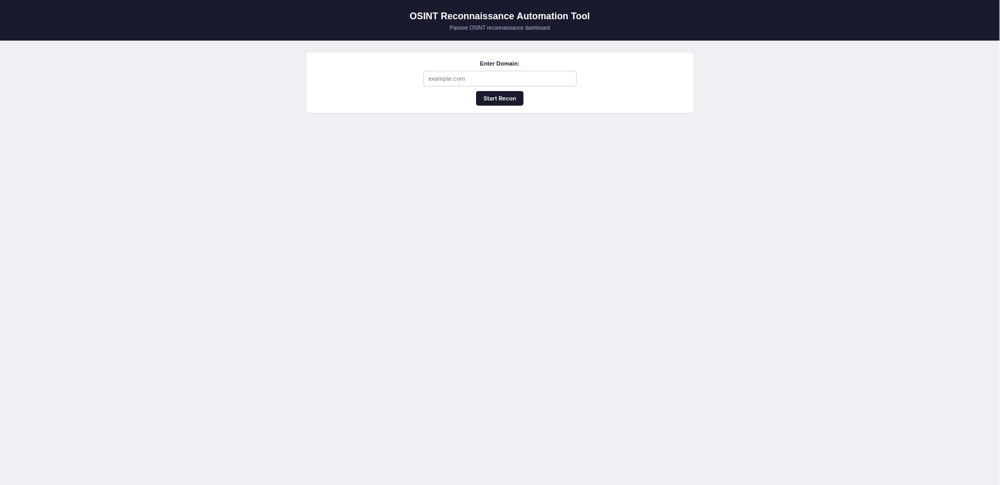
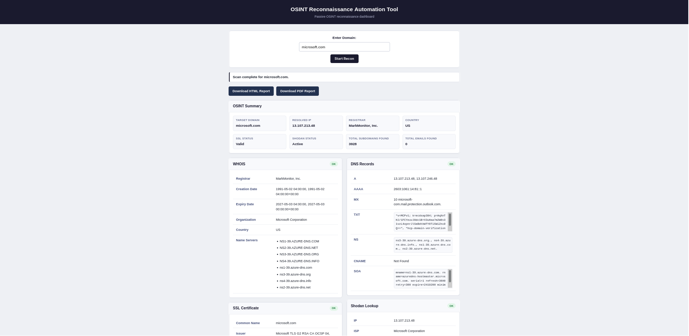
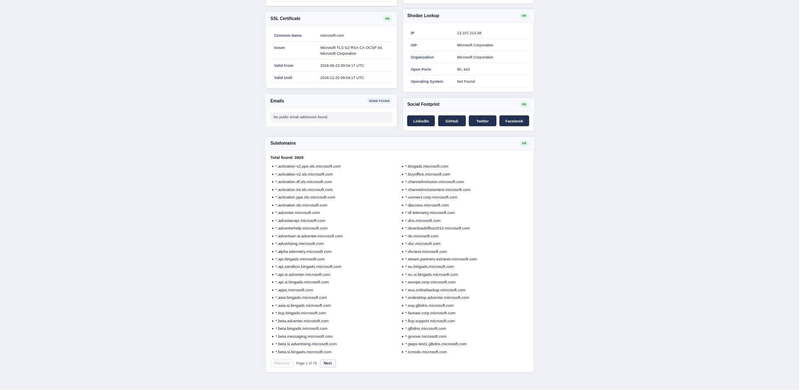
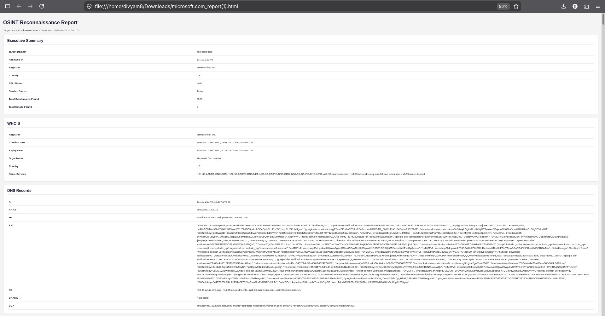
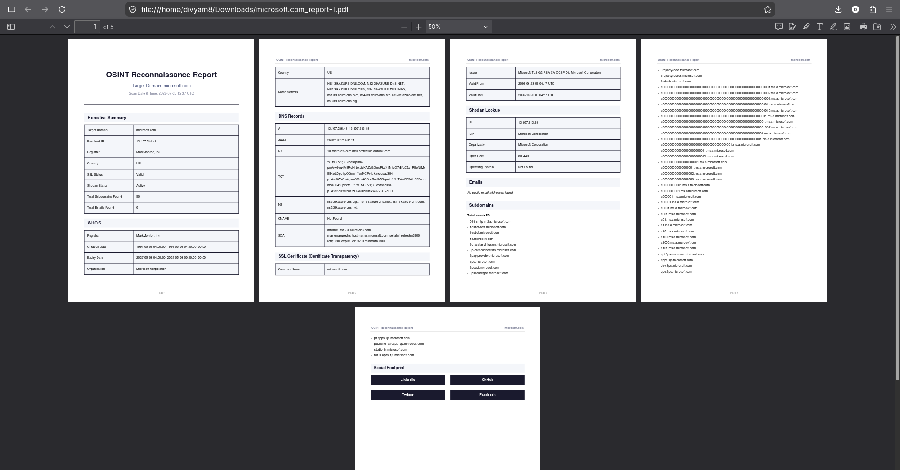

# OSINT Reconnaissance Automation Tool

## Objective

A Flask-based web application that automates passive OSINT reconnaissance for a given domain. The tool collects WHOIS, DNS, SSL, Subdomains, Emails, Social Footprint, and Shodan information, then displays everything in a unified dashboard with downloadable HTML and PDF reports.

---

## Features

- WHOIS Lookup
- DNS Enumeration
- SSL Certificate Inspection
- Passive Subdomain Discovery
- Email Harvesting
- Social Footprint Generation
- Shodan Host Lookup
- HTML & PDF Report Export
- Live Dashboard

---

## Technologies Used

- Python
- Flask
- HTML
- CSS
- JavaScript
- Requests
- python-whois
- dnspython
- Shodan API
- python-dotenv
- fpdf2

---

## Installation

```bash
git clone <repo-url>
cd osint-recon-tool

python -m venv venv

# Linux
source venv/bin/activate

# Windows
venv\Scripts\activate


pip install --upgrade pip

pip install -r requirements.txt
```

Create `.env`

```
SHODAN_API_KEY=YOUR_API_KEY
```

Run

```bash
python run.py
```

---

## Usage

1. Enter a domain.
2. Start Recon.
3. View the dashboard.
4. Download HTML or PDF report.

---

## Folder Structure

```
osint-recon-tool/
│
├── app/
├── config/
├── modules/
├── docs/
├── logs/
├── tests/
├── run.py
├── requirements.txt
└── README.md
```

---

## Screenshots


## Screenshots

### Homepage



---

### Dashboard


 

---

### HTML Report



---

### PDF Report


---

